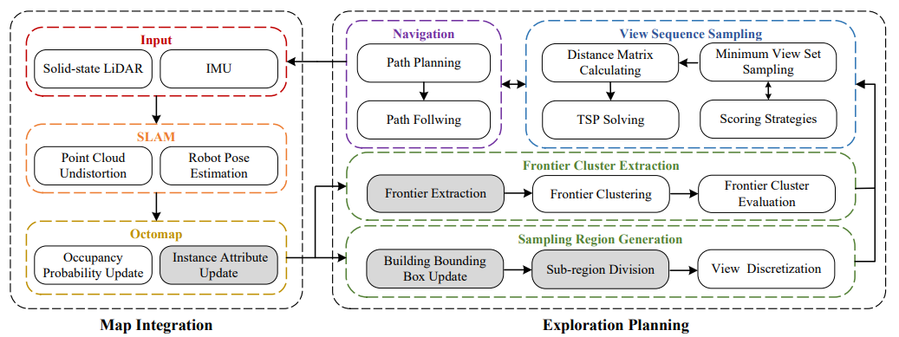

# Object-Aware View Planning for Autonomous 3D Model Reconstruction of Buildings Using a Mobile Robot

## 1. Introduction

The view planning approach aims at 3D model reconstruction of buildings using outdoor mobile robot using a solid-state LiDAR and a gimbal. We introduce object awareness into the map representation to reconstruct the specific
buildings while ignoring unrelated objects in the environment. Frontier- and sampling-based strategies are combined to plan the view sequences for the effective observation of a target building. Note that this is a extended project of our previous work [RAMBO](https://github.com/HITSZ-NRSL/RAMBO) , wherein some unused functions were removed and new functions have been developed.

Authors: Yuxiang Li, Jiancheng Wang, [Haoyao Chen](https://github.com/HitszChen) from [the Networked RObotics and Sytems Lab](http://www.nrs-lab.com/), Yunhui Liu, and Xin Jiang.

If you use the project for your academic research, please cite the following paper .

```
@ARTICLE{10132570,
  author={Li, Yuxiang and Wang, Jiancheng and Chen, Haoyao and Jiang, Xin and Liu, Yunhui},
  journal={IEEE Transactions on Instrumentation and Measurement}, 
  title={Object-Aware View Planning for Autonomous 3D Model Reconstruction of Buildings Using a Mobile Robot}, 
  year={2023},
  volume={},
  number={},
  pages={1-1},
  doi={10.1109/TIM.2023.3279424}}
```



[Video&Paper](https://ieeexplore.ieee.org/document/10132570)


## 2. Installation
Tested on Ubuntu 18.04 with ROS Melodic. 
- Install Dependencies
```bash
sudo apt install libsuitesparse-dev ros-"$ROS_DISTRO"-ros-control 
ros-"$ROS_DISTRO"-controller-manager 
ros-"$ROS_DISTRO"-joint-state-controller 
ros-"$ROS_DISTRO"-effort-controllers 
ros-"$ROS_DISTRO"-ros-controllers 
ros-"$ROS_DISTRO"-gazebo-ros-control 
ros-"$ROS_DISTRO"-transmission-interface 
ros-"$ROS_DISTRO"-velodyne-simulator 
ros-"$ROS_DISTRO"-turtlebot3 
ros-"$ROS_DISTRO"-move-base 
ros-"$ROS_DISTRO"-pointcloud-to-laserscan 
ros-"$ROS_DISTRO"-dwa-local-planner 
ros-"$ROS_DISTRO"-global-planner 
ros-"$ROS_DISTRO"-costmap-converter 
ros-"$ROS_DISTRO"-teb-local-planner 
ros-"$ROS_DISTRO"-octomap-msgs 
ros-"$ROS_DISTRO"-octomap-ros 
binutils-dev
```

- Clone 3rd-Party Packages. Follow our previous work [RAMBO](https://github.com/HITSZ-NRSL/RAMBO) to install the third-party dependencies.
```bash
mkdir catkin_ws/src -p
cd catkin_ws/src
git clone https://github.com/HITSZ-NRSL/RAMBO_3rd_party_packages.git
```

- Compile
```bash
cd catkin_ws/src
git clone https://github.com/HITSZ-NRSL/active_mapping_dvc.git
cd ../
catkin build
```

## 3. Run Examples
- Gazebo
```bash
roslaunch active_mapping mr1000_gazebo_house.launch
```

- Mapping
```bash
roslaunch active_mapping mr1000_ac_house.launch
```
