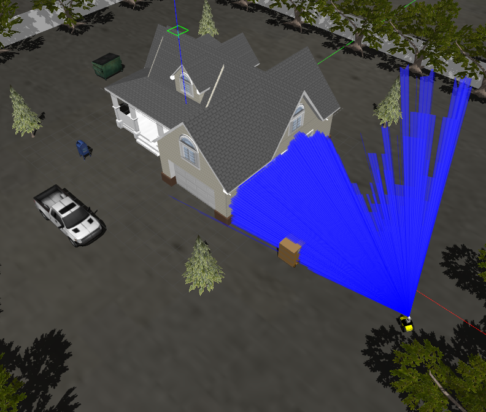
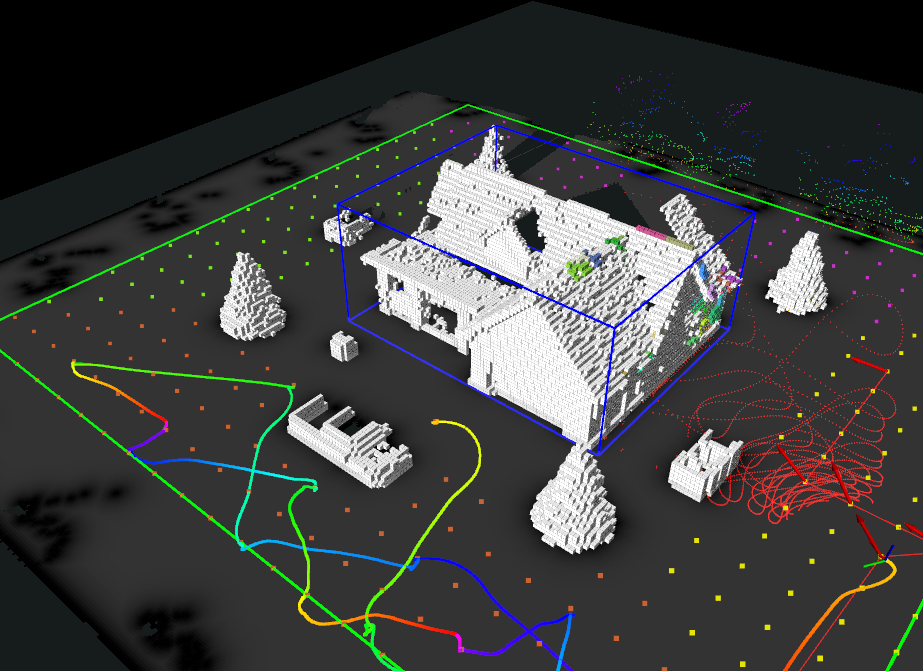

# A Novel Object-aware Strategy for Autonomously Reconstructing 3D Building Model with Unmanned Ground Vehicle





## 1.Prerequisites

```bash
sudo apt install libsuitesparse-dev ros-"$ROS_DISTRO"-ros-control 
ros-"$ROS_DISTRO"-controller-manager 
ros-"$ROS_DISTRO"-joint-state-controller 
ros-"$ROS_DISTRO"-effort-controllers 
ros-"$ROS_DISTRO"-ros-controllers 
ros-"$ROS_DISTRO"-gazebo-ros-control 
ros-"$ROS_DISTRO"-transmission-interface 
ros-"$ROS_DISTRO"-velodyne-simulator 
ros-"$ROS_DISTRO"-turtlebot3 
ros-"$ROS_DISTRO"-move-base 
ros-"$ROS_DISTRO"-pointcloud-to-laserscan 
ros-"$ROS_DISTRO"-dwa-local-planner 
ros-"$ROS_DISTRO"-global-planner 
ros-"$ROS_DISTRO"-costmap-converter 
ros-"$ROS_DISTRO"-teb-local-planner 
ros-"$ROS_DISTRO"-octomap-msgs 
ros-"$ROS_DISTRO"-octomap-ros 
binutils-dev
mkdir catkin_ws/src -p
cd catkin_ws/src
git clone https://github.com/HITSZ-NRSL/RAMBO_3rd_party_packages.git
```

## 2.Installation && Build

```bash
git clone https://github.com/HITSZ-NRSL/active_mapping_dvc.git
catkin build
```

## 3.Run in simulation

```bash
source ./devel/setup.bash
roslaunch active_mapping mr1000_gazebo_house.launch
roslaunch active_mapping mr1000_ac_house.launch
```

## 4. Documentation

- Coming soon.
